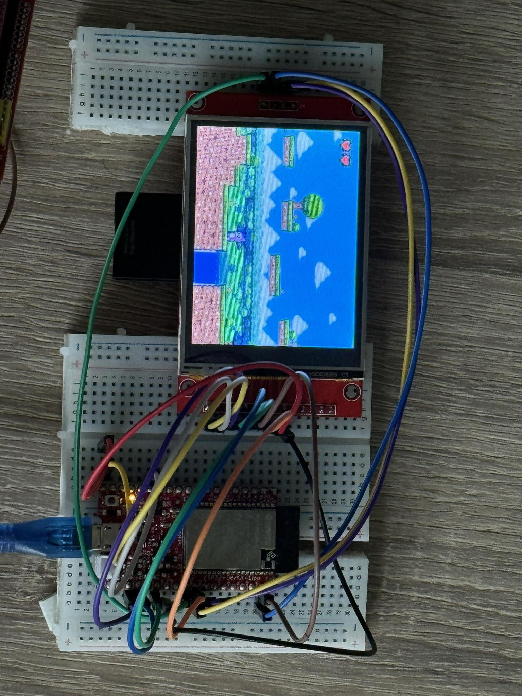
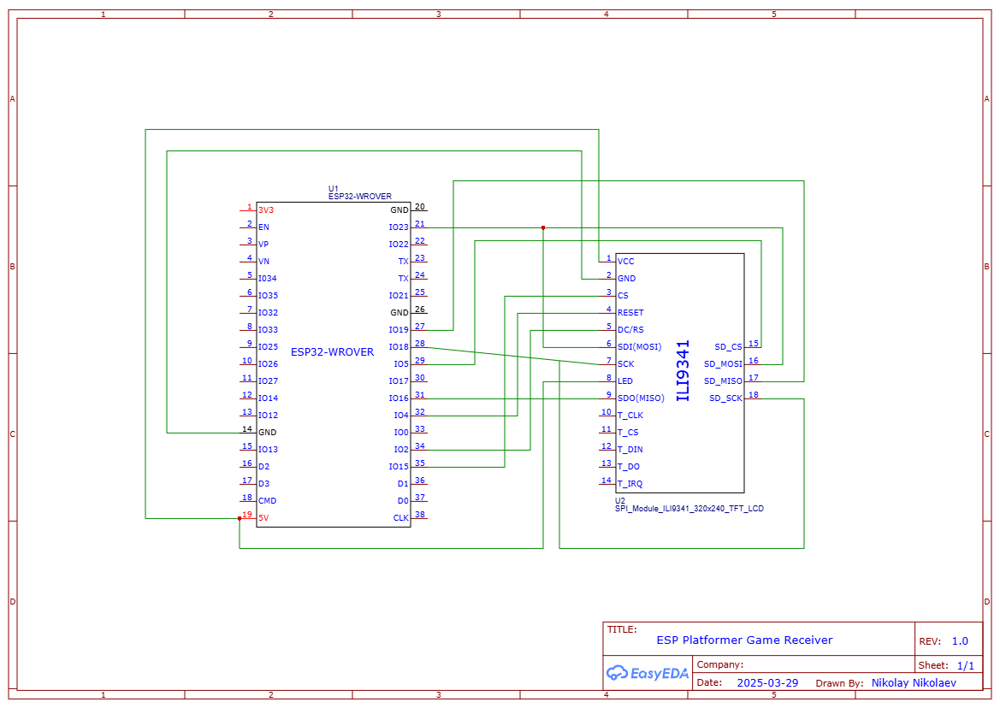
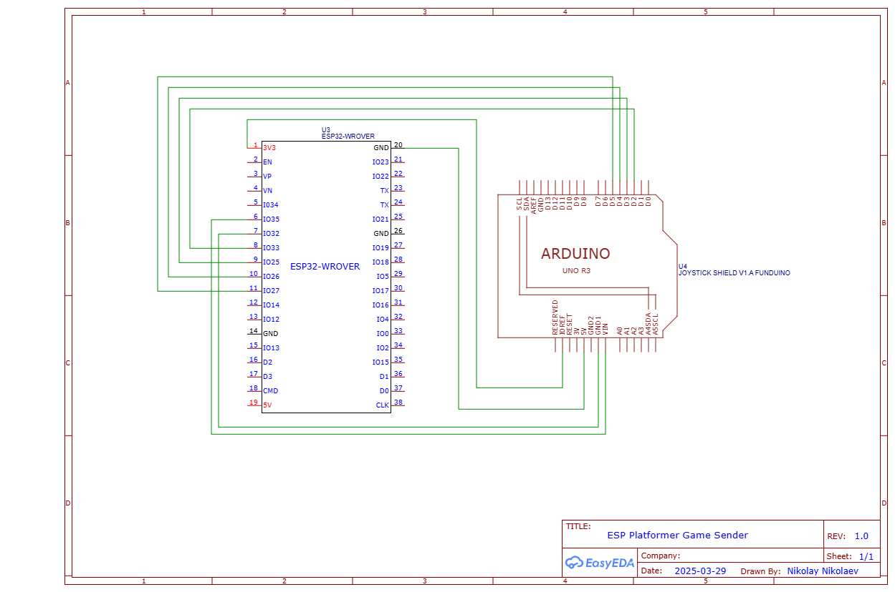

# 🎮 ESP32 Platformer Game
A simple platformer game controlled wirelessly using two ESP32 devices and ESP-NOW communication.

## 📌 Features
✅ Character jumps between platforms and loses a life if it falls into water  
✅ Wireless control using a separate ESP32-based controller  
✅ ESP-NOW protocol for fast and efficient communication  
✅ Graphics stored and loaded from an SD card  
✅ Object-oriented code structure for easy modifications  

## 🚀 Technologies Used
- **Microcontrollers:** ESP32 (two devices)
- **Communication Protocol:** ESP-NOW
- **Display:** TFT LCD (connected to receiver ESP32)
- **Storage:** SD Card (for game graphics)
- **Programming Language:** C++ (Arduino framework)

## 🛠 Installation & Setup
### 1️⃣ Flashing the Code
- **Receiver ESP32 (with display & SD card):** Flash `receiver_esp_now_oop.ino` + supporting files in directory
- **Sender ESP32 (controller):** Flash `sender_esp_now.ino`

### 2️⃣ Preparing the SD Card
- Copy the contents of the folder `graphics_for_sd_card` to the SD card
- Insert the SD card into the receiver ESP32

### 3️⃣ Running the Game
1. Power on both ESP32 devices
2. The receiver ESP32 will initialize the display and load graphics
3. Use the controller ESP32 to move the character in the game

## 🎮 Gameplay
🎮 **Move Left / Right** → Control the character using the joystick on the controller ESP32  
⬆️ **Jump** → Press the up button on the controller  
🌊 **Lose a Life** → Falling into water decreases the player's lives  
❌ **Game Over** → If all lives are lost, the game resets  

## 🖥️ Game Preview

## 🔌 Wiring Diagrams

## 🎥 Watch Gameplay Video  

## 💡 Future Improvements
- [ ] Add sound effects  
- [ ] Implement a scoring system with stars  
- [ ] Add enemies  
- [ ] Enhance graphics and animations  
- [ ] Add multiplayer mode  
# ESP32-Platformer-Game
